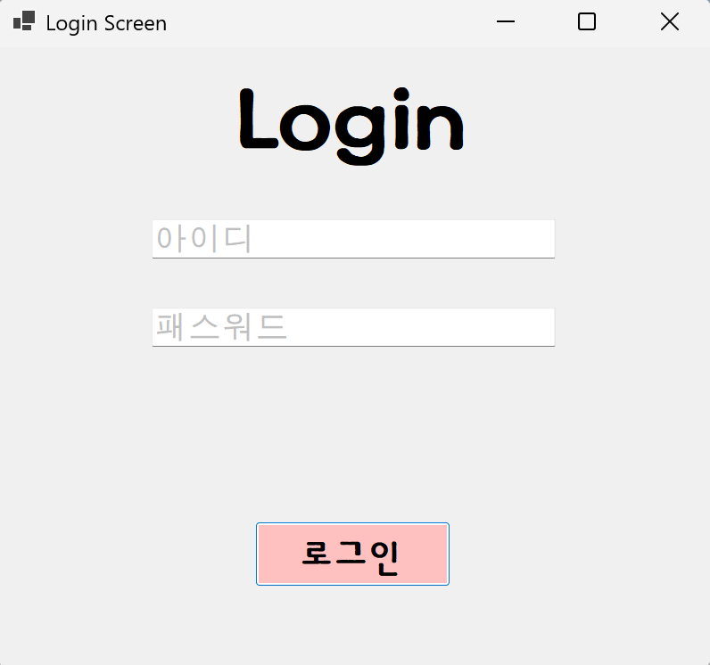
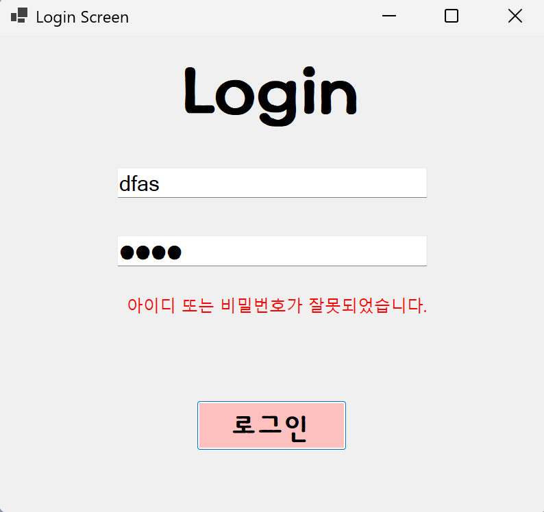

#5주차 과제: (C# 코딩) Login screen (로그인 화면)
-이름: 하다현 (24018097)

## 개요
- C# 프로그래밍 학습
- 1줄 소개: 사용자로부터 아이디와 패스워드를 입력받아 로그인 여부를 판단하는 프로그램
- 사용한 플랫폼: C#, .NET Windows Forms, Visual Studio, GitHub, Visual Code
- 사용한 컨트롤: Label 1개, TextBox 2개, Button 1개 + MessageBox / 상태 표시 Label
- 사용한 기술과 구현한 기능:
  - Visual Studio를 이용하여 UI 디자인
  - TextBox를 이용한 사용자 입력 처리
  - 이벤트 기반 프로그래밍(Click, Enter, Leave, KeyDown)
  - 조건문과 논리연산자(&&)를 이용한 로그인 검증
  - Placeholder 기능 구현 (Enter / Leave 이벤트)
  - 사용자 입력 검증 및 예외 처리
  - 로그인 실패 메시지 화면 출력 (Label Visible 활용)
  - 로그인 시도 횟수 제한 기능 구현
-핵심 키워드:
  -  컨트롤: Label, TextBox, Button
  - 속성: Text, ForeColor, BackColor, UseSystemPasswordChar, Visible
  - 메서드: Focus(), PerformClick()
  - 이벤트: Enter, Leave, Click, KeyDown

---

## 실행 화면 (과제1)

- 과제 내용
  - TextBox 2개(아이디, 패스워드), Button(로그인), Label을 배치
    cf) Label -> lblAppName
	Textbox2개: txtID(아이디)
			txtPW(비밀번호)
        Button: btnLogin(로그인 버튼)
			
  - TextBox 2개(아이디, 패스워드), Button(로그인), Label을 배치
  - Placeholder를 이용하여 입력 안내 표시 (Placeholder: 뭘 입력해야 되는지 알려주는 힌트 텍스트)
  - 로그인 버튼 클릭 시 아이디와 패스워드 검사
  - 로그인 성공/실패 메시지 출력

- 구현 내용과 기능 설명
  - 아이디 입력창과 비밀번호 입력창을 구성하고 각각 placeholder를 표시하였다.
  - 비밀번호 입력창은 UseSystemPasswordChar 속성을 사용하여 입력값이 보이지 않도록 처리하였다.
  - 로그인 버튼 클릭 시 미리 설정된 아이디와 패스워드와 비교하여 로그인 여부를 판단하였다. (아이디와 패스워드가 모두 맞아야 로그인 허용)
  - 아이디와 패스워드가 모두 일치하면 "로그인 성공", 그렇지 않으면 "로그인 실패" 메시지를 MessageBox로 출력한다.

   +) 구현 시나리오
      - 처음 상태: TextBox에 "아이디" 표시 (색상:Silver)
      - 마우스 클릭, 또는 탭으로 이동하면: 글자 사라짐
      - 입력 가능 상태 : 사용자가 입력할 수 있음
      - 다시 비어 있으면: "아이디" 다시 표시

      - 속성 창(번개모양)에 들어가서 Enter와 Leave 이벤트 설정
      - [보기] -> [탭 순서(B)] 메뉴에서 포커스 순서 정하기 ( 1.로그인->2. 아이디->3.패스워드
      - txtPw_Enter 함수에는 txtPW.UseSystemPasswordChar = true; 추가(글자 보이게), txtPw_Leave 함수에는 txtPW.UseSystemPasswordChar = false; 추가 ( 글자 안 보이게)

-사용한 기술과 구현한 기능:
  - TextBox 입력값 비교 (string 비교)
  - MessageBox.Show()를 이용한 결과 출력
  - UseSystemPasswordChar를 이용한 비밀번호 숨김 처리
  - Enter / Leave 이벤트를 이용한 Placeholder 구현
	
     +) 속성설정(패스워드 입력 시 내용이 보이지 않게 처리)
	 아이디와 패스워드가 모두 맞아야 로그인 성공: 논리연산자 && 사용

 ---

## 실행 화면 (과제2)

- 과제 내용
  - 입력창 자동 초기화
  - 포커스 이동
  - Enter 키 전송
  - 공백 입력 방지

- 구현 내용과 기능 설명
    - 로그인 실패 시 MessageBox를 사용하는 대신, 화면에 Label을 배치하여 오류 메시지를 표시하였다.
    - 평상시에는 Label을 숨겨두고(Visible = false), 로그인 실패 시에만 Visible을 true로 변경하여 메시지를 출력하였다.
    - 사용자 입장에서 어떤 부분이 잘못되었는지 직관적으로 확인할 수 있도록 UI를 개선하였다.

  - 사용한 기술과 구현한 기능
    - Label.Visible 속성을 이용한 메시지 제어
    - 조건문을 이용한 로그인 실패 처리
    - UI 기반 오류 피드백 구현

---

## 실행 화면 (과제3)

** 모두 btnSend_Click() 함수에서 작업하면 됨.

- 과제 내용
  - Enter 키를 이용한 로그인 기능 구현
  - 입력 흐름 개선 (아이디 → 비밀번호 → 로그인)
  - 사용자 편의 기능 추가
 
- 구현 내용과 기능 설명
  - 아이디 입력 후 Enter 키를 누르면 비밀번호 입력창으로 포커스가 이동하도록 구현하였다.
  - 비밀번호 입력 후 Enter 키를 누르면 로그인 버튼 클릭 이벤트가 실행되도록 하였다.
  - 버튼 클릭 없이 키보드만으로 로그인할 수 있도록 UX를 개선하였다.
  - 입력 내용을 한 번에 지우는 기능과 비밀번호를 표시/숨김 처리하는 기능을 추가하여 사용자 편의성을 높였다.

- 사용한 기술과 구현한 기능
  - KeyDown 이벤트를 이용한 Enter 키 처리
  - Focus()를 이용한 입력창 이동
  - PerformClick()을 이용한 버튼 이벤트 실행
  - UI/UX 개선 기능 구현

---

## 실행 화면 (과제4)
.png)

- 과제 내용
  - 아이디 및 패스워드 입력값 검증
  - 로그인 시도 횟수 제한 기능 구현

- 구현 내용과 기능 설명
  - 아이디에 사용할 수 없는 문자나 형식을 제한하고, 비밀번호에 필요한 조건을 설정하여 입력값을 검증하였다.
  - 로그인 실패 횟수를 카운트하여 일정 횟수 이상 실패 시 로그인 시도를 제한하였다.
  - 일정 시간이 지난 후 다시 로그인할 수 있도록 하여 보안성을 강화하였다.
  - 추가적으로 한 단계 더 확인 절차를 넣어 로그인 과정을 강화하였다.

- 사용한 기술과 구현한 기능
  - 문자열 검사 (Length, Contains 등 활용)
  - 조건문을 이용한 입력 검증
  - 변수로 로그인 시도 횟수 관리
  - Timer 또는 시간 비교를 이용한 재시도 제한

---

## +) 기능 설명

### 1단계 - 기본 UI 배치 및 기능 구현
  1. UI구성
    - Label로 "Login" 제목 만들기
    - 로그인을 위한 Button 생성
    - 사용자 입력을 위한 TextBox 2개 생성(로그인, 비밀번호)

  2. Placeholder 기능
    - 입력 전 안내 텍스트를 회색으로 표시
    - 입력 시 자동으로 제거되고, 비어 있으면 다시 표시

  3. 로그인 처리
    - 입력값을 비교하여 로그인 성공/실패 판단
    - 결과를 MessageBox로 출력("로그인 성공", "로그인 실패")

### 2단계 - 에러 표시 개선
  1. 화면 내 오류 표시
    - Label을 이용해 아이디 또는 패스워드가 잘못 입력됐을 때 에러 메시지를 화면에 표시
    - Visible 속성을 이용해 메시지 보이기와 숨기기 기능 구현
  2. UX 개선
    - 사용자에게 즉각적인 피드백 제공
    - 불필요한 MessageBox 사용 최소화

### 3단계 - UX 개선(사용자 편의성 향상)
  1. Enter 키를 누르면 로그인 되도록 포커스 흐름 정리
   - 아이디 입력 -> Enter 누르면 패스워드 입력 창으로 넘어가기
   - 패스워드 입력 -> Enter누르면 로그인 시작하기

  2. 추가 기능
    - 전체 입력 삭제 기능
    - 패스워드를 보여주는 기능(보기/숨기기 가능)
   

### 4단계 - 데이터 관리 및 심화 기능
  1. 아이디와 패스워드 입력 문자 확인
    - 아이디에 넣을 수 없는 글자 체크
    - 비밀번호에 넣을 수 없거나 꼭 들어가야 하는 문자 체크
  2. 로그인 시도 제한
    - 일정 회수가 지나면 정해진 시간 후에 재시도 가능하게
    -  한 단계 더 체크하기
    - 조금 더 복잡하고 

     
---

## 구현 시 어려웠던 점
- Placeholder 기능이 기본적으로 제공되지 않아 Enter / Leave 이벤트로 직접 구현해야 했던 점이 어려웠다.
- 